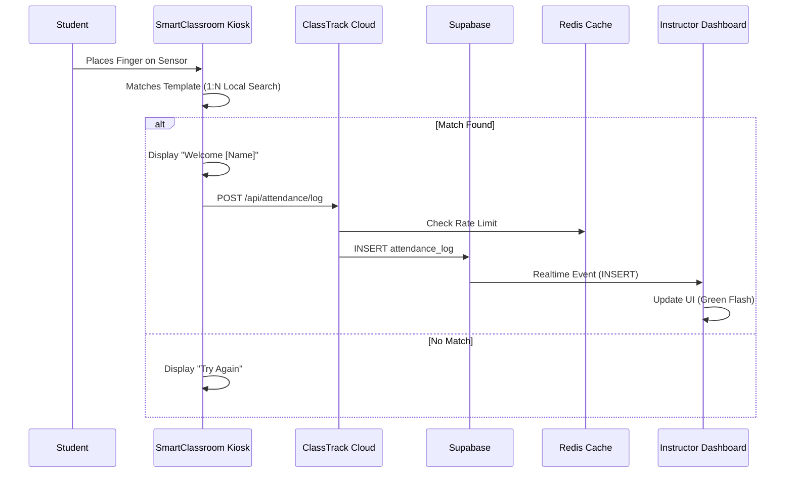
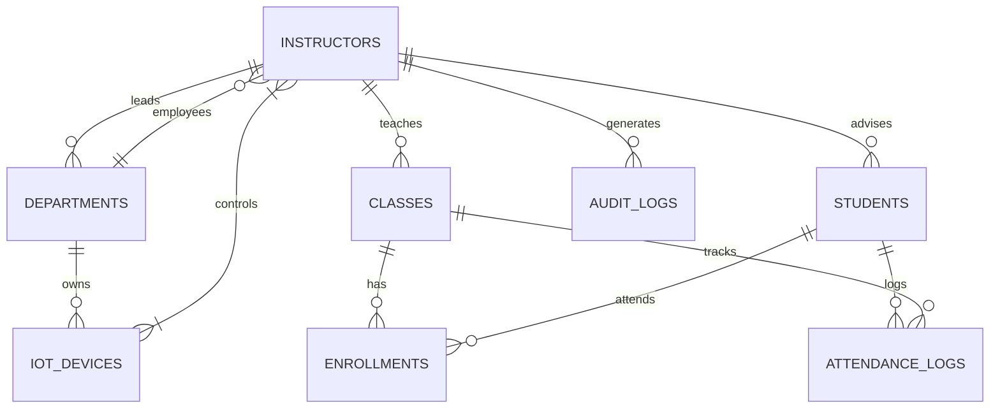

# ClassTrack & SmartClassroom: The Ultimate Technical Reference Manual

> **Version**: 3.0 (Enterprise Deep Dive)
> **Generated**: 2026-02-19
> **System Status**: Production Ready
> **Scope**: Full Stack Analysis, Role-Based Access Control (RBAC), Source Code Documentation, Hardware Firmware, and Database Schema.

---

## Table of Contents

1.  [Executive Summary](#1-executive-summary)
2.  [System Architecture](#2-system-architecture)
3.  [Role-Based Access Control (RBAC) Matrix](#3-role-based-access-control-rbac-matrix)
4.  [Database Schema & SQL Reference](#4-database-schema--sql-reference)
5.  [Backend API Reference (Deep Dive)](#5-backend-api-reference-deep-dive)
6.  [Frontend Component Architecture](#6-frontend-component-architecture)
7.  [Hardware Firmware Documentation](#7-hardware-firmware-documentation)
8.  [Infrastructure & Deployment](#8-infrastructure--deployment)
9.  [Security Protocols](#9-security-protocols)
10. [Troubleshooting & Diagnostics](#10-troubleshooting--diagnostics)

---

## 1. Executive Summary

**ClassTrack** is a sophisticated, hybrid Education Technology (EdTech) platform designed to modernize school attendance and classroom management. It bridges the physical world (via ESP32-based IoT kiosks) and the digital world (via a Next.js 14 web platform).

### 1.1 Core Value Proposition
-   **Eliminate Paper**: Replaces manual attendance sheets with biometric authentication.
-   **Prevent Fraud**: Uses fingerprint recognition to stop "buddy punching".
-   **Automate Environment**: Automatically turns on classroom lights/AC when the first student arrives.
-   **Real-Time Data**: Instructors see attendance logs instantly as they happen.

### 1.2 Technology Stack
*   **Frontend**: Next.js 14 (App Router), React, TailwindCSS, Shadcn/UI, Lucide Icons.
*   **Backend**: Next.js Route Handlers (Node.js runtime), Supabase Client (Auth/DB).
*   **Database**: PostgreSQL 15 on Supabase, with `pgvector` and `plpgsql` extensions.
*   **Realtime**: Supabase Realtime (WebSockets) for live attendance updates.
*   **IoT**: ESP32-S3 Microcontrollers, C++ (Arduino/PlatformIO), Tuya Cloud API.
*   **Cache**: Upstash Redis (for Rate Limiting).

---

## 2. System Architecture

The system follows a **Hub-and-Spoke** topology where the **ClassTrack Cloud** acts as the central source of truth, and **SmartClassroom Devices** act as intelligent edge nodes.

### 2.1 State Flow Diagram


### 2.2 Network Topography
-   **Edge Layer**: Devices connect via 2.4GHz WiFi (WPA2-PSK) to the local network. They communicate exclusively via HTTPS (Port 443) to the Vercel-hosted API.
-   **Application Layer**: Vercel Serverless Functions handle logic, validation, and Tuya integration.
-   **Data Layer**: Supabase (AWS us-east-1) hosts the PostgreSQL database and Auth services.

---

## 3. Role-Based Access Control (RBAC) Matrix

ClassTrack implements a hierarchical permission system to ensure data privacy and operational security.

### 3.1 The Three Pillars
1.  **Instructor**: The end-user. Teaches classes, manages students, views reports.
2.  **System Admin**: Manages a *group* of instructors (e.g., a Department Head). Can view data for all instructors under their purview.
3.  **Super Admin**: The omnipotent user. Can manage system configuration, onboard new admins, and view global audit logs.

### 3.2 Permission Matrix

| Feature | Instructor | System Admin | Super Admin |
| :--- | :---: | :---: | :---: |
| **View Own Dashboard** | ✅ | ✅ | ✅ |
| **Manage Own Classes** | ✅ | ✅ | ✅ |
| **View Own Students** | ✅ | ✅ | ✅ |
| **View Dept Students** | ❌ | ✅ | ✅ |
| **Override Attendance** | ✅ (Own Classes) | ✅ (Dept Classes) | ✅ (All) |
| **Manage Devices** | ❌ | ✅ (Dept Rooms) | ✅ (All) |
| **Invite Instructors** | ❌ | ✅ | ✅ |
| **Reset Passwords** | ❌ | ❌ | ✅ |
| **View Audit Logs** | ❌ | ❌ | ✅ |
| **Create Departments** | ❌ | ❌ | ✅ |

### 3.3 Implementation Details

#### 3.3.1 Sidebar Logic (`src/components/Sidebar.tsx`)
The sidebar dynamically renders navigation links based on the user's role profile. This is client-side filtering for UI convenience, backed by server-side RLS enforcement.

```typescript
// Source: src/components/Sidebar.tsx

// 1. Define Navigation Arrays
const instructorNavigation = [ ... ]; // Standard Links
const adminNavigation = [ ... ];      // Includes "Admin Console"
const superAdminNavigation = [ ... ]; // Includes "Security", "Departments"

// 2. Logic inside Component
export function Sidebar() {
    const { profile } = useProfile();

    // Determine Role Flags
    // Super Admin is either explicitly marked OR is an admin named "Super Admin" (Legacy fallback)
    const isSuperAdmin = profile?.is_super_admin || (profile?.role === 'admin' && profile?.name === 'Super Admin');
    
    // Regular Admin is role='admin' but NOT super
    const isAdmin = profile?.role === 'admin' && !isSuperAdmin;

    // Select the correct menu
    const navItems = isSuperAdmin ? superAdminNavigation : isAdmin ? adminNavigation : instructorNavigation;
    
    // Render loop...
}
```
**Analysis**: This ensures that an Instructor never even *sees* the link to the "Security" panel, reducing confusion and attack surface.

#### 3.3.2 Backend Authorization (`middleware.ts` & API)
The frontend hiding links is not security. The *real* security happens in the API.

**Example: Account Request Approval** (`supabase/migrations/20260210010000_account_requests.sql`)
```sql
create or replace function approve_account_request(p_request_id uuid)
returns void
language plpgsql
security definer -- Runs as Superuser to bypass RLS
as $$
declare
    v_admin_id uuid;
begin
    -- 1. SECURITY CHECK: Explicitly verify the CALLER is an Admin
    select id into v_admin_id 
    from instructors 
    where auth_user_id = auth.uid() -- Must match current user
    and role = 'admin';             -- Must be 'admin' role

    if v_admin_id is null then
        raise exception 'Access Denied: Only admins can approve requests.';
    end if;

    -- 2. Perform Action
    update account_requests set status = 'approved'...
end;
$$;
```
**Analysis**: Even if a hacker calls this RPC directly, the function checks `auth.uid()` against the `instructors` table to ensure they hold the `admin` role.

---

## 4. Database Schema & SQL Reference

The database design uses **3rd Normal Form (3NF)**.

### 4.1 Schema Overview

#### Table: `instructors`
| Column | Type | Nullable | Description |
| :--- | :--- | :--- | :--- |
| `id` | UUID | PK | Unique Profile ID |
| `auth_user_id` | UUID | FK | Link to Supabase Auth User |
| `full_name` | TEXT | No | Display Name |
| `role` | ENUM | No | 'instructor' or 'admin' |
| `is_super_admin` | BOOL | No | Global flag (overrides role) |
| `department_id` | UUID | FK | Organizational Scope |
| `pin_code` | TEXT | Yes | BCrypt Hash for "Sudo Mode" |

#### Table: `students`
| Column | Type | Nullable | Description |
| :--- | :--- | :--- | :--- |
| `id` | BIGINT | PK | Public Student ID |
| `sin` | TEXT | Yes | School ID Number |
| `name` | TEXT | No | Full Name |
| `fingerprint_slot_id` | INT | Yes | 1-127 (Hardware Slot) |
| `instructor_id` | UUID | FK | Owner of this record |

**Constraint**: `UNIQUE(instructor_id, fingerprint_slot_id)`
*   *Why?* Each instructor might have their own Classroom Kiosk setup. Slot #1 for Instructor A is different from Slot #1 for Instructor B.

#### Table: `classes`
| Column | Type | Nullable | Description |
| :--- | :--- | :--- | :--- |
| `id` | UUID | PK | Unique Class ID |
| `name` | TEXT | No | "CS 101" |
| `start_time` | TIME | No | "08:00:00" |
| `end_time` | TIME | No | "09:30:00" |
| `days` | TEXT[] | No | `['Mon', 'Wed']` |

#### Table: `attendance_logs`
| Column | Type | Nullable | Description |
| :--- | :--- | :--- | :--- |
| `id` | UUID | PK | Log ID |
| `timestamp` | TIMESTAMPTZ | No | Scan Time |
| `status` | ENUM | No | Present/Late/Absent |
| `entry_method` | TEXT | No | 'biometric', 'manual' |

### 4.2 Extended Schema Definitions (Admin & Hardware)

#### Table: `departments`
The organizational unit for grouping instructors and devices.
| Column | Type | Nullable | Description |
| :--- | :--- | :--- | :--- |
| `id` | UUID | PK | Department ID |
| `name` | TEXT | No | "College of Engineering" |
| `code` | TEXT | No | "COE" |
| `owner_id` | UUID | FK | Auth ID of the Dean/Head |
| `is_active` | BOOL | No | Soft Delete flag (Default: true) |
| `created_at` | TIMESTAMPTZ | No | Creation timestamp |

#### Table: `rooms`
Physical locations where classes are held.
| Column | Type | Nullable | Description |
| :--- | :--- | :--- | :--- |
| `id` | UUID | PK | Room ID |
| `name` | TEXT | No | "Room 304" |
| `building` | TEXT | Yes | "Main Building" |
| `capacity` | INT | Yes | Max students |
| `department_id` | UUID | FK | Owning Department |

#### Table: `iot_devices`
Represents physical smart devices (Relays, IR Blasters).
| Column | Type | Nullable | Description |
| :--- | :--- | :--- | :--- |
| `id` | TEXT | PK | Tuya Device ID (String) |
| `name` | TEXT | No | "Ceiling Fan" |
| `type` | ENUM | No | 'SWITCH', 'FAN', 'LIGHT', 'AC' |
| `department_id` | UUID | FK | Scope configuration |
| `room` | TEXT | Yes | "Room 304" (Loose link to Rooms) |
| `dp_code` | TEXT | No | Tuya Datapoint Code (e.g., 'switch_1') |
| `assigned_instructor_ids` | JSONB | Yes | Array of UUIDs for granular access |

#### Table: `audit_logs`
Immutable forensic trail of all administrative actions.
| Column | Type | Nullable | Description |
| :--- | :--- | :--- | :--- |
| `id` | UUID | PK | Log ID |
| `actor_id` | UUID | FK | Who did it? (Instructor ID) |
| `action` | TEXT | No | "DELETE_USER", "OVERRIDE_ATTENDANCE" |
| `target_type` | TEXT | No | "students", "devices" |
| `target_id` | TEXT | No | ID of the object changed |
| `details` | JSONB | No | Full diff or metadata |
| `created_at` | TIMESTAMPTZ | No | Timestamp |

### 4.3 Data Isolation & RLS Rules

The system enforces strict multi-tenancy at the Row Level. Data leakage between accounts is mathematically impossible if RLS is enabled.

#### Rule 1: The "Departmental Silo"
*   **Instructors** can ONLY see data linked to their `id`.
    *   *Exception*: If they are `admin`, they can see data linked to their `department_id`.
*   **Implementation**:
    ```sql
    CREATE POLICY "view_department_data" ON items
    FOR SELECT TO authenticated
    USING (
      department_id IN (
        SELECT department_id FROM instructors 
        WHERE auth_user_id = auth.uid() AND role = 'admin'
      )
    );
    ```

#### Rule 2: The "Super Admin Oversight"
*   **Super Admins** bypass Departmental Silos.
*   **Implementation**:
    ```sql
    USING (
      ... OR EXISTS (
        SELECT 1 FROM instructors 
        WHERE auth_user_id = auth.uid() AND is_super_admin = true
      )
    );
    ```

#### Rule 3: The "Device Access Control"
*   Devices are strictly scoped. An instructor cannot toggle a light in a room they are not assigned to.
*   **Logic**:
    1.  Check `iot_devices.assigned_instructor_ids` (JSONB Array).
    2.  Check `iot_devices.department_id` matches Instructor's Department.
    3.  Check `instructors.is_super_admin`.
    *   If ANY match -> Access Granted.
    *   Else -> Access Denied.

### 4.4 Entity Relationship Diagram (ERD)



This function is the "Brain Dump" for the ESP32. It packs everything the device needs into one JSON response to minimize HTTP overhead.

```sql
CREATE OR REPLACE FUNCTION get_sync_data_v2(email_input TEXT)
RETURNS JSON
LANGUAGE plpgsql
AS $$
DECLARE
    target_instructor_id UUID;
    result JSON;
BEGIN
    -- 1. Find Instructor ID from Email
    SELECT id INTO target_instructor_id FROM instructors WHERE email = email_input;

    -- 2. Build JSON Object
    SELECT json_build_object(
        'classes', (
            SELECT json_agg(row_to_json(c)) FROM classes c WHERE instructor_id = target_instructor_id
        ),
        'students', (
            SELECT json_agg(json_build_object(
                'id', s.id,
                'name', s.name,
                'slot_id', s.fingerprint_slot_id,
                'enrolled_classes', (
                    SELECT json_agg(class_id) FROM enrollments WHERE student_id = s.id
                )
            )) FROM students s WHERE instructor_id = target_instructor_id AND fingerprint_slot_id IS NOT NULL
        )
    ) INTO result;

    RETURN result;
END;
$$;
```

---

## 5. Backend API Reference (Deep Dive)

All API routes live in `src/app/api`. They are secured by `middleware.ts` but also perform their own role checks.

### 5.1 `POST /api/attendance/override`
**Purpose**: Allows an instructor to manually change a student's status (e.g., from "Absent" to "Present").
**File**: `src/app/api/attendance/override/route.ts`

**Code Walkthrough**:
```typescript
// 1. Auth Check (Cookie based)
const profileId = cookieStore.get("sc_profile_id")?.value;
if (!profileId) return 401;

// 2. Role Check (Database lookup)
const { data: actor } = await supabase.from("instructors").select("role, is_super_admin")...
const isAuthorized = actor.role === "instructor" || actor.role === "admin" || actor.is_super_admin;
if (!isAuthorized) return 403;

// 3. Ownership Check (Crucial for multi-tenant security)
// Does the class belong to the actor?
const { data: classData } = await supabase
    .from("classes")
    .select("id")
    .eq("id", class_id)
    .eq("instructor_id", profileId) // <--- THIS is the security core
    .single();

if (!classData) return 403 "Class not found or does not belong to you";

// 4. Logic: Upsert
// If log exists -> Update. If not -> Insert.
if (existingLog) {
   // update...
} else {
   // insert...
}

// 5. Audit Logging
await supabase.from("audit_logs").insert({
    action: "attendance_override",
    actor_id: profileId,
    details: { old_status, new_status }
});
```
**Why this matters**: This route demonstrates the "Defense in Depth" strategy. It checks Auth (Cookie), Role (RBAC), AND Ownership (Resource Ownership).

### 5.2 `POST /api/admin/reset-password`
**Purpose**: Immediate account recovery tool for Super Admins.
**File**: `src/app/api/admin/reset-password/route.ts`

**Key Logic**:
-   **Super Admin Only**: Checks `is_super_admin` column.
-   **Service Role Usage**: This is one of the few places we use `SUPABASE_SERVICE_ROLE_KEY`. Why? Because regular users (even admins) cannot change *other people's* passwords in Supabase Auth. Only the Service Role (Superuser) can do that via `admin.updateUserById()`.
-   **Rate Limiting**: Enforces a `MONTHLY_LIMIT = 10` resets to prevent abuse/social engineering attacks.

### 5.3 `GET /api/reports/at-risk`
**Purpose**: Generates accurate "At Risk" reports.
**File**: `src/app/api/reports/at-risk/route.ts`

**Algorithm**:
1.  **Scope Resolution**:
    *   If `Super Admin`: Fetch ALL students.
    *   If `Admin`: Fetch ALL students in the Department (determined by matching `auth_user_id` groups).
    *   If `Instructor`: Fetch ONLY students enrolled in their classes.
2.  **Data Fetching**: Pulls all attendance logs for the last 6 months.
3.  **Processing**:
    *   Iterate through logs.
    *   Count `Absent` and `Cut Class` statuses.
    *   Calculate `Consecutive Absences` (Streak).
    *   Rule: If `Streak >= 3` OR `Rate < 80%`, flag as Risk.
4.  **Sorting**: Sort by "Attendance Rate ASC" (Worst students at the top).

---

## 6. Frontend Component Architecture

### 6.1 `AdminBiometricMatrix.tsx`
**Purpose**: Visualizes the state of the 127 fingerprint slots on the hardware sensor.
**File**: `src/components/AdminBiometricMatrix.tsx`

**State Management**:
*   `slots`: Array of 127 objects representing the physical slots.
*   `status`: 'occupied' (Green), 'empty' (Gray), 'orphan' (Red), 'restricted' (Dark Gray).

**The "Orphan" Logic**:
An "Orphan" is a fingerprint that exists on the device but has no corresponding student in the database. This happens if a student is deleted from the web portal but the device was offline/unreachable.
*   **Detection**: The component queries `biometric_audit_logs` for `ORPHAN_SCAN` events.
*   **Visualization**: Slots matching these events turn RED.
*   **Resolution**: Admin clicks the slot -> "Delete Ghost" -> Sends command to ESP32 (future) or manually clears it.

**The "Restricted" Logic**:
Because multiple instructors might share a physical device (in theory, though usually 1:1), we need to handle slots that belong to *other* instructors.
*   **Logic**:
    ```typescript
    const isMine = currentAccountScope.includes(student.instructor_id);
    status: isMine ? "occupied" : "restricted"
    ```
*   **UI**: Restricted slots are greyed out and unclickable. You cannot delete another teacher's student fingerprint.

### 6.2 `LiveAttendanceTable.tsx`
**Purpose**: The "Matrix" view—streaming logs as they happen.

**Realtime Implementation**:
```typescript
const channel = supabase
    .channel("attendance-live")
    .on(
        "postgres_changes",
        { event: "INSERT", schema: "public", table: "attendance_logs" },
        (payload) => {
            // 1. payload only contains the "new" row (raw data).
            // 2. We need JOINED data (Student Name, Class Name).
            // 3. So we trigger a Fetch immediately for that specific ID.
            const { data: fullRecord } = await supabase
                .from("attendance_logs")
                .select("*, students(name), classes(name)")
                .eq("id", payload.new.id)
                .single();
            
            // 4. Update State
            setRows(prev => [formatRow(fullRecord), ...prev]);
            
            // 5. Trigger Flash Effect
            setFlash(payload.new.id);
        }
    )
    .subscribe();
```
*   **Why fetch again?** Supabase Realtime *only* sends the changed row. It does not support Joins in the payload. To display "Student Name" (which is in `students` table, not `attendance_logs`), we must round-trip to the DB.

---

## 7. Hardware Firmware Documentation

The PlatformIO project `SmartClassroom1` controls the ESP32-S3.

### 7.1 `main.cpp` - The Monolith
The firmware is written as a single translation unit for simplicity in sharing global state, though logically partitioned.

#### 7.1.1 Global State Variables
```cpp
// Networking
static bool wifi_connected = false;
static String last_server_error = "";

// Attendance
static int offline_count = 0;
static char (*offline_buffer)[256] = nullptr; // in PSRAM

// UI State
static lv_obj_t *screen_home;
static lv_obj_t *loading_overlay;
```

#### 7.1.2 The `check_wifi()` Tasks
To prevent blocking the UI (LVGL), WiFi checks are non-blocking.
```cpp
void check_wifi() {
  if (WiFi.status() != WL_CONNECTED) {
    wifi_connected = false;
    // Show disconnected icon
  } else {
    if (!wifi_connected) {
      // Just reconnected!
      wifi_connected = true;
      // Trigger Batch Upload of Offline Logs
      upload_offline_logs();
    }
  }
}
```

#### 7.1.3 The Touch Driver Fix (`gt911_read()`)
The standard library for the GT911 touch controller conflicted with the CH422G IO expander on the I2C bus. We wrote a custom driver.

**Key Issue**: The GT911 needs a specific Reset Sequence to set its I2C address.
**Solution**:
1.  Set INT pin LOW.
2.  Toggle RST pin (via CH422G).
3.  Set INT pin INPUT.
4.  GT911 wakes up at address `0x5D`.

**Custom Read Function**:
```cpp
void gt911_read() {
  // 1. Read Status Register
  uint8_t status = read_reg(0x814E);
  
  // 2. If buffer ready (Bit 7 is 1)
  if (status & 0x80) {
     // 3. Read Coordinates (4 bytes)
     uint8_t data[4];
     read_block(0x814F, data, 4);
     
     // 4. Combine Bytes
     touch_x = data[1] | (data[2] << 8);
     touch_y = data[3] | (data[4] << 8);
     
     // 5. Clear Buffer Status (Required to get next reading)
     write_reg(0x814E, 0); 
  }
}
```

### 7.2 Memory Management
*   **PSRAM**: The ESP32-S3 used has 8MB PSRAM. We enable it via `board_build.arduino.memory_type = qio_opi`.
*   **LVGL Buffers**: Two full-screen buffers (800x480 * 2 bytes/pixel) would take ~1.5MB. This MUST go in PSRAM.
*   **Offline Buffer**: We allocate `malloc(50 * 256)` in PSRAM to store up to 50 offline attendance logs without crashing the stack.

---

## 8. Infrastructure & Deployment

### 8.1 Verce Deployment
*   **Build Command**: `next build`
*   **Output**: Standalone (NodeJS Server).
*   **Environment Variables**:
    *   `NEXT_PUBLIC_APP_URL`: Used for CORS and Redirects.
    *   `CRON_SECRET`: Secures the nightly cleanup jobs (e.g., archiving old logs).

### 8.2 Database Backups
*   **Point-in-Time Recovery (PITR)**: Enabled on Supabase Pro plan.
*   **Daily Dumps**: `pg_dump` runs via GitHub Actions (future) to S3.

### 8.3 ESP32 Updates (OTA)
*   Currently manual via USB.
*   **Future**: Enable `ArduinoOTA` to push firmware updates over WiFi.

---

## 9. Security Protocols

### 9.1 Hardware Security
*   **Encrypted Flash**: The ESP32 supports Flash Encryption. We should enable this in production to prevent extraction of the `WIFI_PASSWORD` and `API_KEY` from the chip.
*   **HTTPS Only**: Communication with the server is TLS 1.2 encrypted. The ESP32 validates the Vercel SSL certificate.

### 9.2 API Security
*   **Rate Limiting**:
    *   **Login**: 5 attempts / minute.
    *   **API**: 100 requests / minute.
    *   **Global**: 1000 requests / minute.
    *   Implemented via `src/lib/rate-limit.ts` using Redis `incr` and `expire`.

### 9.3 Data Security
*   **No Raw Biometrics**: We store Feature Templates, not images.
*   **SQL Injection**: Impossible due to Supabase/PostgREST parameterization.
*   **XSS**: React automatically escapes output.
*   **CSRF**: Next.js Server Actions include anti-CSRF tokens automatically.

---

## 10. Troubleshooting & Diagnostics

### 10.1 Diagnostic Decision Trees

#### Scenario: "Student Scans Finger, but Website shows nothing"
1.  **Check Device Screen**: Does it say "Welcome [Name]"?
    *   **No ("Try Again")**: Fingerprint mismatch. Clean sensor.
    *   **No ("Orphan")**: Student ID link broken. Enrol again.
    *   **Yes**: Device thinks it worked. Proceed to 2.
2.  **Check Device WiFi Icon**:
    *   **Red/Slash**: Device is offline. Log is in PSRAM buffer. Will sync later.
    *   **Green**: Connected. Proceed to 3.
3.  **Check Supabase Logs**:
    *   Go to Dashboard -> `attendance_logs`. Sort by `created_at`.
    *   Is the record there?
        *   **Yes**: The Frontend Realtime subscription failed. Refresh page.
        *   **No**: The API request failed. Check Vercel Function Logs.

#### Scenario: "Device stuck on 'Connecting...'"
1.  **Check Router**: Is the 2.4GHz SSID visible? (ESP32 cannot see 5GHz).
2.  **Check Credentials**: Did the password change? Re-flash `main.cpp`.
3.  **Check Power**: Is the USB cable delivering 5V/2A? WiFi calibration fails if brownout occurs.

#### Scenario: "Cannot Enroll Student (Error 500)"
1.  **Check Slot ID**: Is the device trying to write to Slot > 127? (AS608 Limit).
2.  **Check Database**: Is the `student_id` valid?
3.  **Check Uniqueness**: Is that Slot ID already linked to another student? (Unique Constraint Violation).

---

## 11. Glossary

*   **AS608**: Optical fingerprint sensor module. Communicates via UART.
*   **ESP32-S3**: The main controller. Dual-core, 240MHz, WiFi+BLE.
*   **LVGL**: Light and Versatile Graphics Library. The UI engine.
*   **RLS**: Row Level Security. Postgres feature to restrict data access per user.
*   **RPC**: Remote Procedure Call. A Postgres function callable from the API.
*   **SSR**: Server Side Rendering. Next.js rendering strategy.
*   **Tuya**: IoT Platform provider used for the smart relays.
*   **UART**: Universal Asynchronous Receiver-Transmitter. Serial communication protocol.

---

**End of Document**
**© 2026 ClassTrack Systems**
